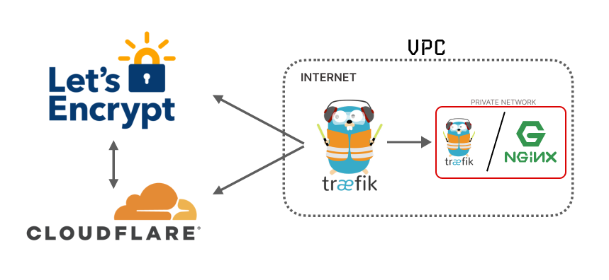

<p align="center">
    
</p>

# Docker Compose Traefik (Cloudflare SSL)

This guide shows you how to deploy your containers behind Traefik reverse-proxy. It will obtain and refresh `HTTPS` certificates automatically and it comes with password-protected Traefik dashboard.

## Precautions

- MAKE: The make utility is one of the handiest utilities for a programmer. [Doc](https://linuxhandbook.com/using-make/)
- YQ: A lightweight and portable command-line YAML, JSON, INI and XML processor. [Doc](https://github.com/mikefarah/yq)

## Docker container

### Main container

- Docker Socket Proxy version `3.2.1/latest`
- Traefik version: `v3.4.x`
- Traefik Logrotate version: `latest`

### Docker container:

- Docker Socket Proxy - `Linuxserver.io` [Doc](https://hub.docker.com/r/linuxserver/socket-proxy)
- Traefik [Doc](https://hub.docker.com/_/traefik)
- Logrotate & Cron [Doc](https://github.com/vegardit/docker-traefik-logrotate)

### Step 1: Make Sure You Have Required Dependencies

- Git
- Docker
- Docker Compose

### Step 2: Clone the Repository

```bash
git clone https://github.com/asapdotid/dcc-traefik.git
cd dcc-traefik
```

Make command help:

```bash
make help
```

### Step 3: Make Initial Environment Variables

```bash
make init
```

Modified file in `.make/.env` and `src/.env` for setup containers

### Step 4: Make Initial 3 Secret Files

```bash
make secret
```

Modified files on `.secrets` directory.

1. cloudflare_email.secret
2. cloudflare_api_token.secret
3. traefik_users.secret

### Step 5: Create

#### Token Configuration Steps

1. Token Name:

- Give your token a name, such as **Traefik DNS Challenge**.

2. Permissions:

- Click **Add permissions**.
- Choose **Zone** as the service.
- Select **DNS** as the resource.
- Choose **Edit** as the action.

3. Zone Resources:

- Click **Add Zone Resources**.
- Select **Include**.
- Choose **All Zones** or **Specific Zone** to restrict access to a particular zone.
  - If choosing **Specific Zone**, specify the domain, e.g., `example.com`.

4. **Client IP Address Filtering** (optional):

- Add specific IP addresses if you want to restrict token usage to certain IPs.

5. **TTL** (optional):

- Set a token expiration period if needed.

6. Create and Save the API Token

- Click **Continue to summary**.
- Review the token settings to ensure they are correct.
- Click **Create Token**.

> Edit **secrets** file for **Cloudflare Email** and **Cloudflare API DNS Token** on `.secrets` directory.

1. `cloudflare_email.secret` for email
2. `cloudflare_api_token.secret` for API token

### Step 6: Setup User and Password for Traefik Dashboard (Enable is optional)

Traefik dashboard optional, please check `src/.env`:

```bash
...
TRAEFIK_DASHBOARD=true # true or false, default true
...
```

Note: when used in compose.yml all dollar signs in the hash need to be doubled for escaping.

> Install `Apache Tools` package to using `htpasswd`
> To create a `user`:`password` pair, the following command can be used:

```bash
echo $(htpasswd -nb user)

# OR

echo $(htpasswd -nb user password)
```

Running script:

```bash
echo $(htpasswd -nb admin)
# result:
admin:$apr1$W3jHMbEG$TCzyOICAWv/6kkraCHKYC0
```

or

```bash
echo $(htpasswd -nb admin adminpass)
# result:
admin:$apr1$W3jHMbEG$TCzyOICAWv/6kkraCHKYC0
```

The output has the following format: `username`:`password_hash`. The username doesn't have to be `admin`, feel free to change it (in the first line).

Encode password hash with `base64`:

```bash
echo '$apr1$W3jHMbEG$TCzyOICAWv/6kkraCHKYC0' | openssl enc -e -base64
JGFwcjEkVzNqSE1iRUckVEN6eU9JQ0FXdi82a2tyYUNIS1lDMAo=
```

Check decode:

```bash
echo 'JGFwcjEkVzNqSE1iRUckVEN6eU9JQ0FXdi82a2tyYUNIS1lDMAo=' | openssl enc -d -base64
```

> Edit **secrets** file for **Traefik Dashboard** auth (defaulr user: `admin` & password: `adminpass`)

1. `traefik_users.secret` for auth (>= one user)

### Step 7: Launch Your Deployment

Optional create docker network `proxy` for external used with other docker containers:

```bash
docker network create proxy
```

Docker composer make commands:

```bash
make up
# or
make down
```

### Step 8: Test Your Deployment

Please change to real `domain name` registered on `cloudflare`

#### Traefik Dashboard:

Add url filter on your `hosts` linux `/etc/hosts`. real domain name:

```bash
sudo nano /etc/hosts
```

Add filter:

```bash
127.0.0.1     traefik.domain_name.com
```

Address: `https://traefik.domain_name.com/`

## License

MIT / BSD

## Author Information

This Docker Compose Traefik was created in 2025 by [Asapdotid](https://github.com/asapdotid) 🚀
